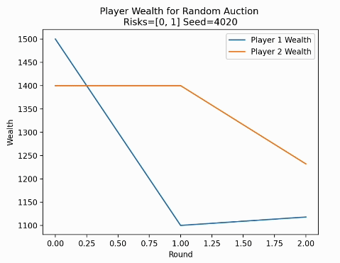

# CS 506 Final Project: Predicting Monopoly Board Game Outcomes

## Collaborators 
* Laya Dang (pd03@bu.edu)
* Gabi Guillermo (gabe441@bu.edu)

## How to build and run
1. Run `make install` to create virtual environment and install dependencies
2. In `main.py`, uncomment the last two lines to collect all game simulations data. This will take about an hour. Note this was already done, and results are stored as CSV files in the `results`directory
   - Running this again will duplicate all data already there
3. Run all code blocks in `cleaning.ipynb` to get the `results/full_data.csv` file.
4. Run all code blocks in `model.ipynb` to get the `results/decision_tree_model.pkl` file. This is the final model that predicts Monopoly game outcome at about a **73% accuracy**.
5. Alternatively, skip steps 2-4 and run `make test` to demonstrate a sample of data collection and running the model with prediction. 

## Project Description 
This project aims to model a two-player auction-based monopoly board game to find the best strategy of accumulating the most wealth by the end of the game. In this game scenario, every unbought property immediately goes to auction when a player lands on it. The strategy would be how much a player chooses to bid on the property. We hope to find a consistent winning strategy that takes into consideration player's current wealth, opponent's current wealth, price, rent, number of properties in the same neighborhood already owned, and so on.

For the sake of simplicity, we will NOT implement ability to:
- Upgrade properties (i.e. build houses and hotels),
- Chance/community chest cards,
- Going to jail, and
- Auction off owned property when rent cannot be paid (so player automatically loses if they cannot pay rent).

## Methodology
### Game Logic Implementation
There are three main Python objects in this simulation. The `Board` class will follow available data on the classic Board and keep track of property information (price, tax, neighborhood). The `Player` class has the ability to roll the die, keep track of owned property and wealth, specify a player's valuation function, and so on. The `Game` object simulates a game by having `Board` and `Player` interact, by simulating auctions when applicable and when game-ending criterion is met.

As a recap, these are the rules and key game elements of Monopoly :
1. **Board Layout**: 
   - The board consists of 40 squares, including properties, utilities, railroads, and special spaces (like "Go," "Free Parking," and "Income Tax").
   - Properties are divided into neighborhoods or color groups.

2. **Properties**: 
   - When a player lands on an unowned property, it immeddiate goes to auction. 
   - If a property is owned by another player, rent must be paid based on the property's value.
   
3. **Wealth**: 
   - Each player starts with $1,500. Players can accumulate wealth through rent collection and passing Go (get $200).
   - Going bankrupt (i.e. cannot pay rent) eliminates a player from the game.
   - Having less wealth when all properties are bought also ends the game.

4. **Rolling the Dice**:
   - Players take turns rolling two dice to move around the board.
   - The outcome of dice rolls determines movement and whether the player lands on an unowned property, owned property, or other squares.

Other game rules can be found at [Hasbro's official rule book](https://www.hasbro.com/common/instruct/00009.pdf).

### Auction Theory
A player's auction strategy will depend on:
- Expected value from the property (rent, how frequently that square gets landed on, what in the neighborhood is already owned)
- Price of property in relation to current wealth 
- Opponent's auction strategy

We will find the best strategy for the most common auction designs, described as:
- **English auctions**: players continue to make higher bids until they are no longer willing to pay higher than the last price
- **Dutch auctions**: a high price is initially set and decreases until a player is willing to pay the current price
- **Vickery auctions**: the highest price bidder wins, but only has to pay the second-highest price
- **Random auctions**: randomly select a bidder that is able to buy the base cost

### Data Collection
The Python objects created above will, by design, track the players' actions and game state throughout each game. The inputs will include player decisions, the outcomes of dice rolls, and auction strategies.

### Feature Extraction
The key features to track for each turn of the game include:
- Current auction design
- Players' wealth
- Players' risk-aversion
- Number of properties owned
- Rent paid
- Auction results (winning bids and price)
- Final results of who won each game
- Neighborhood completeness (number of completed neighborhoods)
- Number of time passing Go
- Total rounds
- Reason for game ending (bankruptcy or all properties bought)

We will run these simulations *n* times, for different auction designs and combinationo of player types, until we have sufficient data for analysis.

## Potential Data Inconsistencies 
Some errors and edge cases that may occur with our data collection may be:
- A player going bankrupt too early in the game before establishing any bidding strategy
    - **Fix**: In the data cleaning stage, accept a valid  game only if each player gets over 20 turns (change this depending on how much sufficient data we have)
- Random outcomes of dice rolls putting too much noise in the data, a.k.a. sometimes players are just "lucky"
    - **Fix**: Run a sufficient number of games and plot dice roll outcomes to ensure it is the expected distribution (2d6 Gaussian distribution)

## Visualizations and Modeling
We are able to visualize wealth throughout the game for each simulation (see `main.py`), which, after observing a handful of demos, showed us that games tend to go on to 300+ rounds where players compete for the last property, or less than 50 to where a player goes bankrupt. This observation tells us that number of rounds is an important feature. 

This is a demo of a random auction run:

*More graphs here about final data* 

## Results
We decided on a decision tree, as it is highly interpretable (we can see which features are most influential) and allows us to understand the decision-making process. Since we do not know which features may not be relevant, the tree's ability to naturally ignore irrelevant features during splitting is advantageous. This ensures that the model focuses only on features that contribute meaningfully to predicting the winner.

Additionally, the decision tree's non-parametric nature makes it ideal for handling non-linear relationships between features, such as interactions between "total rent paid" and "properties owned." This ability is useful given the complexity of game outcomes, where no predefined relationships between features and results are guaranteed.

The final tree has a depth of 10, and these are the top 3:

Properties owned appears to be the most important feature, followed by risk type, rent paid, and number of times passing Go. This matches with what we expected as a general Monopoly strategy, where you try to get as many properties as possible. 

With the 80:20 train test split, we were able to validate the data. The final accuracy and classification report is:

This tells us that the model has similar accuracies for both predicting player 1 and player 2 wins (which is only relevant in our model as who goes first).

## Future Steps
### More data collection 
Since final wealth ended up as an overfitted feature (by game rules, player with less wealth loses if all properties are bought), it would have been better to keep track of average wealth, average wealth differences, average wealth growth per round, or a similar metric.

We could also focus on player growth throughout the game instead of the final stats, such as how quickly players accquire properties. 

### More game features
We ignored many aspects of the original Monopoly game that, in reality, will play a major role in determining the winner, such as Jail, Community/Chance cards, and building houses. Adding these features may be easier now that we have built `board.py`, `game.py`, and `player.py`.

## Project Mid-Semester Update
*Nov 5th Updates:*

Originally, we thought that player landings (what square the player lands on the board) would be evenly distributed between the total number of tiles on the board. The simulations showed otherwise. Square 25 and 31 were the most landed on squares. 

English auctions, which are the most common auction type, were also the more successful auction type when running simulations. The wealth history for both players increased gradually, and the simulation went on for over 500 rounds. We also saw that there is a clear distinction between the winner and loser in the game by seeing the wealth history and the amount of property owned by both players.

The auction alternative that we also have implemented is a random auction, where when a player lands on a property, a random number generator selects which player can buy the property. If the player cannot afford the property, the property goes to the other player.

During the simulations, we could clearly see that the data is more chaotic in terms of wealth history. The simulation went for only ~40 rounds (as opposed to the 500+ in englih auctions) and because of the low number of rounds, the players did not have enough time to recover from spending too much money on properties.

In the english auction, the game ended because every property was bought by the players, while in the random auction, the game ended because one of the players went bankrupt.

- 🎦 [**Presentation**](https://www.youtube.com/watch?v=U9uCqartxlI)
- 📝 [**Slidedeck**](https://docs.google.com/presentation/d/13o0royowmw1D76FW3p66xZmjKX5W7Teozy6wgjHaN7I/edit?usp=sharing)

